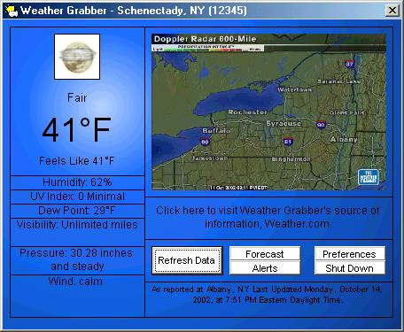



## Weather Grabber 4 \- Updated

### Description

4/16/04 Updated Forecast coding, resized radar to proper size - Here is the original description:

Weather Grabber is a replica of Weather.com's "Desktop Weather" or AWS's "Weather Bug". It uses data gathered from Weather.com and lets the user have instant access to weather information. The program runs in the background as an icon in your system tray, and will download new data regularly to ensure up-to-date information. The icon in the system tray is the outside temperature, like the "Weather Bug". Weather Grabber is fully customizable, including the background (14 different are included), font color, and the ability to can change the interval in which it refreshes the data (or stop it from refreshing). Small pictures that go along with the current weather (such as the sun, clouds, rain, etc.) will automatically be downloaded from Weather.com when needed, and will be saved in the program's directory to avoid downloading them again. The interface displays information about the weather, such as the temperature, wind, humidity, etc., along with a radar which can be instantly enlarged or animated at a click of the mouse. A Quick Forecast, a Detailed Forecast, and Weather Alerts are also available by clicking on buttons on the program's main screen. If a new Weather Alert is issued, a small window will appear for 5 seconds in the corner of the screen notifying the user of it.

In this version, minimal error handling has been implemented. I have tested the program with various zip codes, and have found that it is stable regardless of this. If you do find a bug, please tell me so I can fix it. I hope you find this program useful - Enjoy!
 
### More Info
 

             |
---                |---
**Submitted On**   |2004-04-16 16:39:36
**By**             |[Burbble](https://github.com/Planet-Source-Code/PSCIndex/blob/master/ByAuthor/burbble.md)
**Level**          |Advanced
**User Rating**    |4.9 (34 globes from 7 users)
**Compatibility**  |VB 6\.0
**Category**       |[Complete Applications](https://github.com/Planet-Source-Code/PSCIndex/blob/master/ByCategory/complete-applications__1-27.md)
**World**          |[Visual Basic](https://github.com/Planet-Source-Code/PSCIndex/blob/master/ByWorld/visual-basic.md)
**Archive File**   |[Weather\_Gr1734204162004\.zip](https://github.com/Planet-Source-Code/burbble-weather-grabber-4-updated__1-46647/archive/master.zip)

